# PROJECT_MAP — dilipkumar-dev

Every significant file, its purpose, and how the pieces connect.
Read this before working; update it whenever files are added, moved or removed.

```mermaid
graph TD
    subgraph App["app/ — routes"]
        LAYOUT["layout.tsx<br/>fonts (Instrument Serif / Archivo / IBM Plex Mono)<br/>metadata + OG + Preloader + Cursor"]
        HOME["page.tsx<br/>the scroll narrative — 9 chapters"]
        CASE["work/[slug]/page.tsx<br/>5 SSG case studies"]
        NF["not-found.tsx<br/>'Out of distribution'"]
        CSS["globals.css<br/>OKLCH tokens · .shell rails · .reveal · grain"]
        ICON["icon.svg — loss-curve mark"]
        OG["opengraph-image.tsx — share card"]
    end

    subgraph Lib["lib/ — state + data"]
        CONTENT["content.ts<br/>SINGLE SOURCE OF TRUTH<br/>person · projects · roadmap · skills"]
        OKLCH["oklch.ts<br/>OKLCH to sRGB + verified RENDER constants"]
        SCROLL["scrollStore.ts<br/>one rAF loop · progress · rAF-driven reveals"]
        FOCUS["focusStore.ts<br/>hovered project (DOM writes, shader reads)"]
    end

    subgraph Three["components/three/ — the field"]
        STAGE["Stage.tsx<br/>Canvas · composer · adaptive DPR<br/>no-WebGL + reduced-motion fallbacks"]
        FIELD["ParticleField.tsx<br/>5-target morph · cursor wake · focus pull<br/>stops measured from real sections"]
        GLSL["glsl.ts<br/>simplex · flowField · point vert/frag"]
        TARGETS["targets.ts<br/>noise · name · swiss roll · constellation · ring"]
    end

    subgraph Hud["components/hud/"]
        LOSS["LossCurve.tsx<br/>THE scroll indicator — a real loss curve"]
        NAV["Nav.tsx<br/>chapter rail, active from frame loop"]
    end

    subgraph Sections["components/sections/"]
        SEC["Hero · Identity · Thesis · Signal · Work<br/>Research · Trajectory · Record · Convergence"]
    end

    subgraph Shared["components/"]
        SCRIM["Scrim.tsx — legibility layer (z-5)"]
        DENOISE["DenoiseText.tsx — headings resolve from glyph noise"]
        PRE["Preloader.tsx — the boot sequence"]
        CUR["Cursor.tsx — reticle, idles its own rAF"]
        SP["ScrollProvider.tsx — Lenis + startLoop"]
    end

    subgraph Scripts["scripts/ — evidence, not opinions"]
        VERIFY["verify.mjs<br/>fps · console · reveals · blown highlights · shots"]
        PROF["profile*.mjs · pn.mjs · settle.mjs<br/>isolation with a blank-page control"]
    end

    LAYOUT --> HOME
    LAYOUT --> CASE
    LAYOUT --> NF
    LAYOUT --> PRE
    LAYOUT --> CUR
    LAYOUT --> CSS
    LAYOUT --> CONTENT

    HOME --> SP
    HOME --> STAGE
    HOME --> SCRIM
    HOME --> LOSS
    HOME --> NAV
    HOME --> SEC

    CASE --> SP
    CASE --> STAGE
    CASE --> SCRIM
    CASE --> DENOISE

    SP --> SCROLL
    STAGE --> FIELD
    STAGE --> OKLCH
    FIELD --> GLSL
    FIELD --> TARGETS
    FIELD --> SCROLL
    FIELD --> FOCUS
    FIELD --> OKLCH
    TARGETS --> CONTENT

    LOSS --> SCROLL
    NAV --> SCROLL
    NAV --> CONTENT
    SEC --> CONTENT
    SEC --> DENOISE
    SEC --> FOCUS
    DENOISE --> SCROLL
    OG --> CONTENT
    CSS --> OKLCH

    VERIFY -.measures.-> HOME
    PROF -.measures.-> STAGE

    classDef route fill:#1d2430,stroke:#ffab4d,color:#f4f7fb;
    classDef lib fill:#16202b,stroke:#5fb6d9,color:#f4f7fb;
    classDef three fill:#231d18,stroke:#ffab4d,color:#f4f7fb;
    classDef hud fill:#1a1f29,stroke:#8b98a8,color:#f4f7fb;
    classDef tool fill:#151a22,stroke:#4f5a68,color:#cfe3f2;
    class LAYOUT,HOME,CASE,NF,CSS,ICON,OG route;
    class CONTENT,OKLCH,SCROLL,FOCUS lib;
    class STAGE,FIELD,GLSL,TARGETS three;
    class LOSS,NAV,SEC,SCRIM,DENOISE,PRE,CUR,SP hud;
    class VERIFY,PROF tool;
```



## Rules this map enforces

- **`content.ts` is the only place facts live.** No section hardcodes a claim.
  Adding a project means adding it there; the constellation geometry, the nav,
  the case-study routes and the OG card all follow automatically.
- **Nothing renders per-frame through React.** `scrollStore` is an external
  store; `LossCurve`, `Nav`, `ParticleField` and `Cursor` mutate DOM nodes or
  shader uniforms directly. A `setState` per frame would cost the 3D budget.
- **Layer order is load-bearing:** canvas `z-0` → scrim `z-5` → content `z-10`
  → cursor `z-80` → preloader `z-90`. `body` must stay transparent; an opaque
  background or a negative z-index on the canvas hides the scene while it keeps
  rendering.
- **Render constants in `oklch.ts` are verified, not guessed.** Bloom threshold
  0.92 and exposure 0.96 were confirmed by screenshot analysis (0% blown
  highlights). Re-screenshot before changing them.
- **`scripts/verify.mjs` is the gate.** Any perf claim must come with a
  blank-page control reading above 100fps, or the measurement is not trustworthy.

## Commands

```bash
npm run dev                                  # dev server
npm run build && npx next start -p 3000      # production
node scripts/verify.mjs --url http://localhost:3000   # evidence
```

Debug query params (production-safe, default off): `?fx=0` disables
post-processing, `?msaa=N` sets multisampling, `?n=N` overrides particle count.
