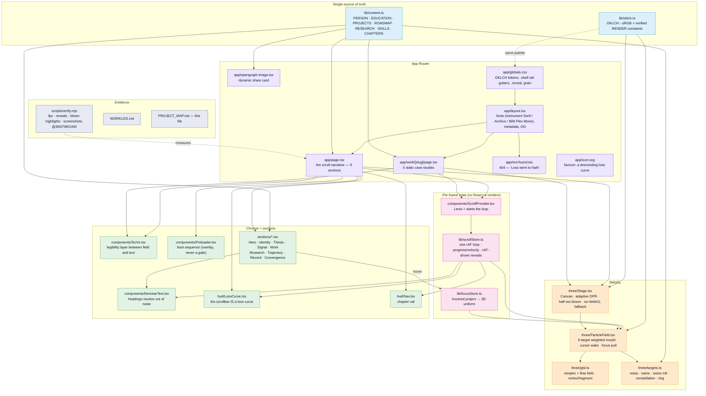

# PROJECT_MAP — dilipkumar-dev

Every significant file, its purpose, and how it connects. (Updated 2026-08-30)



## Load-bearing rules (break these and the site breaks)

- **`body` must stay `background: transparent`.** The canvas is a fixed layer at
  `z-0`; an opaque body (or a negative z-index on the canvas) paints over the
  entire 3D scene while it keeps rendering — invisible, still costing frames.
- **`uSize` in the particle shader is a scale, not pixels.** `gl_PointSize`
  multiplies it by `(300 / -z)` ≈ 30×. Keep it ~0.085. At 2.0 you get 60px
  points and 4fps.
- **Bloom stays at `resolutionScale={0.5}` and `luminanceThreshold` ≥ 0.9.**
  Full-res bloom is 4.5× the frame budget; a low threshold blows the hero white.
- **The colour grade must run after `OutputPass`** (display space), per ORBIT.
- **`.shell`, not ad-hoc padding.** It reserves the left nav rail and right loss
  curve gutters; bare `px-6 lg:px-20` puts text under the instrumentation.
- **Morph stops are measured from real section ids** (`boot`, `identity`,
  `signal`, `work`, `convergence`). Renaming a section id silently falls back to
  hardcoded stops and the field desyncs from the copy.
- **Scroll reveals run in the rAF loop**, never IntersectionObserver — IO
  thresholds stall on instant scroll jumps with Lenis attached.

## Verifying a change

```bash
npm run build && npx next start -p 3001
node scripts/verify.mjs --url http://localhost:3001 --out .verify
```

Gate: 0 console errors, `blown` < 1.5% at every stop, fps ≥ 60 at 1440.
A blank-page control under 100fps means the run is polluted — discard it.
